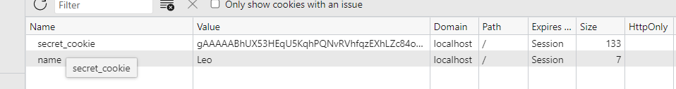

- [1. Abstract](#1-abstract)
- [2. What's new](#2-whats-new)
- [3. Details](#3-details)
  - [3.1. Packet framing from tcp-packet to http-data](#31-packet-framing-from-tcp-packet-to-http-data)
  - [3.2. Multi-threading with non-blocking fd](#32-multi-threading-with-non-blocking-fd)
  - [3.3. Client-side-encrypted-session](#33-client-side-encrypted-session)
    - [3.3.1. Some safety concerns](#331-some-safety-concerns)
    - [3.3.2. How to use Client-side-encrypted-session](#332-how-to-use-client-side-encrypted-session)
# 1. Abstract
This is a Python webserver built upon socket APIs, the server does not follow WSGI standard, and is only for personal practice.

The server lies in the folder `slow_serv/`

The basic way of creating an web application with slow_serv is:
```python
app = slow_serv.Server()
def main(request, response):
    response.body="BIG APP supported by slow_serv"
app.route("/", main)
app.run()
```

# 2. What's new
I got the prototype from this project: 
- https://github.com/littlefish12345/simpwebserv
- Original author: **little_fish12345**

Main changes of my project comparing to the prototype:
- Framing from TCP segment to HTTP message;
- Multi-threading with non-blocking fd;
- Client-side-encrypted-session;
- Add before-route-hooks and after-route-hooks;

- Type Hints and test cases;
  - The whole project is type hinted and type checked with `mypy`.
  - `app_slow_serv.py` demonstrates how to generate a website using slow_serv, and is used in integration test. Run `pytest test_with_server.py` for integration test.
  - Unit tests are distributed in package level, run `pytest` to do all tests.
  
- Load test
    - See load test comparison in locust_test.py.
    - `app_flask.py, app_sanic.py, app_slow_serv.py` are used in load test


# 3. Details
## 3.1. Packet framing from tcp-packet to http-data
This is mainly for myself to practice framing data from transport layer(raw TCP segments) to application layer protocols(HTTP message here), and this can be useful when you want to practice your own protocols over TCP. 

Till now, framing over `Transfer-Encoding: chunked` has not been finished.

## 3.2. Multi-threading with non-blocking fd
I do this for practicing socket programing upon Python socket API, which is a mere encapsulation over C socket API. I was always wondering if multi-threading can be coupled with blocking fd or non-blocking fd, so just give it a try.

Later, I will update this to multiplexing socket communication.

## 3.3. Client-side-encrypted-session
IF you wanna store info on the client side, meanwhile hide the info from the user(and the hacker), client-side-encrypted-session can be an option. 

It can be stored in cookie or LocalStorage:
  - Store in cookie (**I choose for simplicity**)
    - pros: client request will take with it in the header automatically
    - cons: size limit to 4KB
  - store in LocalStorge
    - pros: unlimited size; flexibility to manipulate
    - cons: extra js to send the session, need work on both backend and frontend

### 3.3.1. Some safety concerns
  - Since only the server needs to generate it and read it, we should choose a symmetric encrypting algorithm.
  - Do we need to worry about Replay Attack? I think no, because it is already guaranteed on HTTPS layer. Another point to consider is that if we want to defend Replay Attack on this layer, we need to introduce in an encrypting algorithm with **nonce**, and **nonce** must be maintained on the server side, which violates the original intention of using client-side-session(stateless). So considering both sides, there is no need and no good to use an encrypting algorithm with **nonce**.
  - For communication over HTTP protocol, the streaming safety(defence for MITM attack, Replay Attack / Forbidden Attack) should be protected by HTTPS, CSRF safety should be protected by CSRF token.
  - Client-side storage is provided by JWT(eg: Auth2.0: access token + refresh token), with the drawback of visible to the user.

### 3.3.2. How to use Client-side-encrypted-session
1. Add hooks in `slow_serv/config.py`
```python
from slow_serv.hooks.hook_secret_cookie import secret_cookie_before, secret_cookie_after

HOOKS_BEFORE_VIEW_FUNC = [secret_cookie_before]
HOOKS_AFTER_VIEW_FUNC = [secret_cookie_after]
```
2. Use it directly in your view_function:
```python
app = slow_serv.Server()

def main(request, response):
    # This gives you a normal cookie, you will see one row added in your browser's cookie storage
    response.cookie["name"] = Leo

    # This gives you two secret cookies, they will be combined to one row in your browser's cookie storage
    response.secret_cookie["a"] = 1
    response.secret_cookie["b"] = 2
    response.secret_cookie["c"] = 3

    response.body="BIG APP supported by slow_serv"

app.route("/", main)
app.run()
```
You will see something like this in your browser's cookie storage:



You can see more intuitive examples by looking at `app_slow_serv.py` and `test_app_slow_serv.py`.